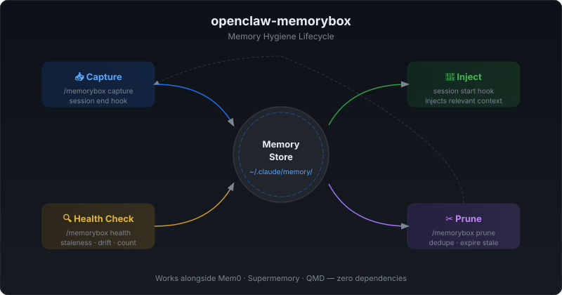

# MemoryBox

> **Claude Code, OpenClaw, 그리고 모든 마크다운 기반 AI 에이전트를 위한 메모리 건강 CLI.**
>
> 한 번 설치하면 에이전트 메모리가 영원히 린하게 유지됩니다. 의존성 없음.

[](https://github.com/Ramsbaby/openclaw-memorybox/stargazers)
[](https://github.com/Ramsbaby/openclaw-memorybox/actions)
[](https://github.com/Ramsbaby/openclaw-memorybox/actions/workflows/lint.yml)
[](https://github.com/Ramsbaby/openclaw-memorybox/releases)
[](https://github.com/openclaw/openclaw)
[](README.md#-claude-code-호환성)
[](https://opensource.org/licenses/MIT)
[](https://www.shellcheck.net/)


> 에이전트 메모리 비대화를 해결했다면 ⭐ 하나가 다른 사람들이 찾는 데 큰 힘이 됩니다.

## 빠른 설치

```bash
curl -fsSL https://raw.githubusercontent.com/Ramsbaby/openclaw-memorybox/main/install.sh | bash
```

<p align="center">
  
</p>

<p align="center">
  <a href="#-빠른-시작">⚡ 빠른 시작</a> •
  <a href="#-비교-memorybox-전후">📊 전후 비교</a> •
  <a href="#-claude-code-호환성">🤖 Claude Code</a> •
  <a href="#-cli-명령어">💻 CLI</a> •
  <a href="#-실제-결과">📈 실제 결과</a> •
  <a href="#-작동-방식">🔧 작동 방식</a> •
  <a href="#-데몬-모드----memorybox-watch-v22-신규">🔄 데몬</a> •
  <a href="#-자주-묻는-질문">❓ FAQ</a>
</p>

<br/>

<p align="center">
  
</p>

<p align="center"><em>한 명령으로 완전 진단: 헬스 체크 → 사이즈 분석 → 중복 → 스테일 컨텐츠 → 제안</em></p>

---

## ⚡ 빠른 시작

> **3개 명령. 30초.**

```bash
# 1. 설치 (원라인)
curl -fsSL https://raw.githubusercontent.com/Ramsbaby/openclaw-memorybox/main/install.sh | bash

# 2. 진단
memorybox doctor ~/openclaw         # OpenClaw
memorybox doctor ~/.claude          # Claude Code

# 3. 수정 (필요시)
memorybox split ~/openclaw          # 인터랙티브: 큰 섹션을 도메인 파일로 이동
memorybox archive ~/openclaw        # 오래된 로그를 archive/로 이동
```

**설치 확인:**
```bash
memorybox --version   # memorybox v2.3.0
```

<details>
<summary>Option B: 수동 설치 (git clone)</summary>

```bash
git clone https://github.com/Ramsbaby/openclaw-memorybox.git
cd openclaw-memorybox && chmod +x bin/memorybox
sudo ln -sf "$(pwd)/bin/memorybox" /usr/local/bin/memorybox
```

</details>

---

## 📊 비교: MemoryBox 전후

| | MemoryBox 없음 | MemoryBox 있음 |
|--|---|---|
| **MEMORY.md 크기** | 무한 증가 (20KB+) | ~3.5KB로 유지 |
| **매 세션 로드** | 전체 (20KB 전부) | 핵심 팩트만 (3.5KB) |
| **컨텍스트 압박** | 98% → 컴팩션 실패 | 7% → 여유 있음 |
| **에이전트 크래시** | 주 2–3회 컨텍스트 오버플로우 | 0 |
| **설정 시간** | — | 5분, 최초 1회 |
| **유지보수** | 수동 또는 방치 | 크론/데몬으로 자동화 |
| **오래된 로그** | 루트에 쌓임 | 14일 후 자동 아카이브 |

**MemoryBox가 방지하는 크래시 연쇄:**
```
메모리 비대화 → 컨텍스트 오버플로우 → 컴팩션 실패 → Gateway 크래시
```

---

## 문제

AI 에이전트의 `MEMORY.md`는 매일 자랍니다. Claude Code, OpenClaw, 어떤 24/7 에이전트든 — 어느 순간 20KB+를 넘어 **모든 세션에** 로드되고, 토큰을 잡아먹고, 결국 컨텍스트 오버플로우나 크래시를 일으킵니다.

MemoryBox가 이것을 5분 안에 막습니다:

```bash
memorybox doctor ~/openclaw   # 진단
memorybox split ~/openclaw    # 인터랙티브 수정
```

MEMORY.md는 린하게 유지됩니다. 에이전트는 빠르게 유지됩니다. **중요한 일에 집중하세요.**

---

## 🔧 작동 방식

MemoryBox는 간단한 3계층 패턴을 적용합니다 ([Letta/MemGPT](https://github.com/letta-ai/letta) 참고):

```
workspace/
├── MEMORY.md              ← Tier 1: 핵심 팩트만 (≤10KB, 모든 곳에 로드)
└── memory/
    ├── YYYY-MM-DD.md      ← Tier 1.5: 일일 로그 (오늘+어제, 자동 로드)
    ├── domains/           ← Tier 2: 상세 참고자료 (온디맨드 검색)
    │   ├── persona.md
    │   ├── decisions.md
    │   └── ...
    ├── projects/          ← Tier 2: 프로젝트별 컨텍스트
    └── archive/           ← Tier 3: 오래된 일일 로그 (14일+ 이후)
```

| 계층 | 로드 시점 | 토큰 비용 |
|------|---------|----------|
| **Tier 1** | 매 세션 자동 | ~3.5KB (린!) |
| **Tier 2** | `memory_search` 온디맨드 | 필요할 때만 |
| **Tier 3** | 수동 참조만 | ~0 |

<p align="center">
  
</p>

---

## 🤖 Claude Code 호환성

MemoryBox는 Claude Code의 `CLAUDE.md` / `AGENTS.md` 워크플로우와 직접 연동됩니다.

**Claude 워크스페이스 지정:**
```bash
memorybox doctor ~/.claude
```

**`CLAUDE.md` 또는 `AGENTS.md`에 추가:**

```markdown
## 메모리 건강 프로토콜

- 헬스 확인: `memorybox health ~/.claude`
- 점수 < 80: `memorybox doctor ~/.claude` 실행 후 제안 따르기
- memory/ 파일을 직접 삭제하지 말 것 — `memorybox archive` 사용
- 구조 변경 후: 다음 rag-index 실행 시 memory/ 자동 RAG 인덱싱
- 큰 MEMORY.md (≥10KB): `memorybox split` 인터랙티브 실행
```

### Claude Code + 데몬 (완전 자동화)

```bash
MEMORYBOX_WORKSPACE=~/.claude \
MEMORYBOX_NTFY_TOPIC=your-ntfy-topic \
bash /path/to/memorybox-watch.sh --daemon
```

### 세션 종료 시 자동 캡처 (Claude Code 훅)

```json
{
  "hooks": {
    "Stop": [{"command": "bash ~/.local/share/memorybox/session-end-hook.sh"}]
  }
}
```

---

## 📈 실제 결과

프로덕션 인스턴스 테스트 (Discord 7채널, 크론 48개, 24/7 운영):

| 지표 | 이전 | 이후 | 개선 |
|------|------|------|------|
| **MEMORY.md 크기** | 20,542 bytes | 3,460 bytes | **-83%** |
| **컨텍스트 압박** | 98% (위험) | 7% (건강) | **-91%** |
| **컴팩션 빈도** | 세션당 여러 번 | 드물게 (~주 1회) | **10배 감소** |
| **Gateway 크래시** | 주 2–3회 | **0** | **100% 안정** |
| **`memory_search`** | 작동 | 그대로 작동 | 변화 없음 |
| **설정 시간** | — | **5분** | 1회성 |

---

## 💻 CLI 명령어

```bash
memorybox doctor [path]           # 전체 진단 — 여기서 시작
memorybox analyze [path]          # 섹션별 사이즈 분석 (바 차트 포함)
memorybox split [path]            # 인터랙티브: 큰 섹션을 도메인 파일로 이동
memorybox health [path]           # 빠른 헬스 점수 (0-100)
memorybox search "<쿼리>" [path]  # 메모리 파일 전문 검색
memorybox archive [path]          # 오래된 일일 로그 (14일+)를 archive/로 이동
memorybox dedupe [path]           # 파일 간 중복 컨텐츠 찾기
memorybox stale [path]            # 오래된 컨텐츠 감지
memorybox suggest [path]          # 개선 권장사항
memorybox report [path]           # 토큰 절약 Before/After 리포트
memorybox init [path]             # 3계층 디렉토리 구조 설정
```

**데몬 모드** (v2.2):
```bash
bash scripts/memorybox-watch.sh --daemon   # 백그라운드 헬스 워처 시작
bash scripts/memorybox-watch.sh --status   # 워처 상태 확인
bash scripts/memorybox-watch.sh --stop     # 워처 중지
```

**대부분의 사용자에게 필요한 명령어는 두 가지뿐:**
1. `memorybox doctor` — 문제 확인
2. `memorybox split` — 인터랙티브 수정

---

## 🔄 데몬 모드 — `memorybox watch` (v2.2 신규)

백그라운드에서 실행. 메모리 헬스가 임계값 아래로 떨어지면 알림 — **에이전트가 크래시되기 전에**.

```bash
# 백그라운드 데몬 시작 (60초마다 체크, 점수 < 80 시 알림)
bash scripts/memorybox-watch.sh --daemon

# 푸시 알림 + 커스텀 인터벌
MEMORYBOX_INTERVAL=120 \
MEMORYBOX_THRESHOLD=85 \
MEMORYBOX_NTFY_TOPIC=your-ntfy-topic \
bash scripts/memorybox-watch.sh --daemon

# Discord 웹훅 사용
MEMORYBOX_DISCORD_URL="https://discord.com/api/webhooks/..." \
bash scripts/memorybox-watch.sh --daemon
```

| 환경 변수 | 기본값 | 설명 |
|----------|--------|------|
| `MEMORYBOX_WORKSPACE` | `~/openclaw` | 모니터링할 워크스페이스 경로 |
| `MEMORYBOX_INTERVAL` | `60` | 체크 간격 (초) |
| `MEMORYBOX_THRESHOLD` | `80` | 이 값 아래로 떨어지면 알림 |
| `MEMORYBOX_NTFY_TOPIC` | — | [ntfy.sh](https://ntfy.sh) 푸시 토픽 |
| `MEMORYBOX_DISCORD_URL` | — | Discord 웹훅 URL |

### 크론 대안 (더 간단)

```json
{
  "name": "Memory Health Watch",
  "schedule": "0 9 * * *",
  "prompt": "Run: memorybox health ~/openclaw. If score < 80, run memorybox doctor and report findings."
}
```

---

## MemoryBox가 아닌 것

**MemoryBox는 유지보수 도구입니다** — 에이전트의 메모리를 위한 `df`와 같습니다.

메모리 시스템을 대체하지 않습니다 — 건강하게 유지합니다.

| 도구 | 역할 | 분류 |
|------|------|------|
| **Mem0** | 무엇을 기억할지 결정 | 🧠 메모리 엔진 |
| **Supermemory** | 클라우드 기반 영속 기억 | 🧠 메모리 엔진 |
| **QMD** | 로컬 검색 백엔드 | 🔍 검색 엔진 |
| **MemoryBox** | 파일을 정리되고 린하게 유지 | 🧹 유지보수 도구 |

**위의 모두와 함께, 또는 아무것도 없이 사용할 수 있습니다.** 파일 구조만 건드립니다 — 설정, 플러그인, 내부는 절대 건드리지 않습니다.

---

## 탄생 배경

24/7로 OpenClaw 에이전트를 운영했습니다 — Discord 7채널, 크론 48개. 학습하면서 `MEMORY.md`가 20KB+로 커졌습니다. 모든 세션이 전부를 로드했죠.

어느 날, 컨텍스트가 100%에 도달했습니다. 컴팩션이 상태를 손상시켰습니다. 설정을 고치려 했고 — **Gateway가 크래시됐습니다.**

그 크래시가 **[openclaw-self-healing](https://github.com/Ramsbaby/openclaw-self-healing)** (자동 복구, ~30초)으로 이어졌습니다. 하지만 *근본 원인*은 메모리 비대화였습니다. 그래서 MemoryBox를 만들었습니다.

```
메모리 비대화 → 컨텍스트 오버플로우 → Gateway 크래시
  → self-healing 제작 (크래시에서 복구)
  → MemoryBox 제작 (비대화 예방)
  → 양쪽에서 문제 해결.
```

---

## 에이전트에게 3계층 패턴 가르치기

`AGENTS.md`에 추가:

```markdown
## 메모리 프로토콜
- **MEMORY.md** (≤10KB): 핵심 팩트만. 모든 곳에 로드 — 린하게 유지.
- **memory/domains/*.md**: 상세 참고자료. `memory_search`로 검색.
- **memory/archive/**: 오래된 로그. 드물게 필요.

MEMORY.md가 8KB를 넘으면 큰 섹션을 domains/로 분리.
```

---

## 호환성

**모든 것과 작동:**

| 플러그인 / 백엔드 | 호환 | 비고 |
|-----------------|------|------|
| memory-core (기본) | ✅ | 변경 불필요 |
| Mem0 | ✅ | 다른 레이어 — 충돌 없음 |
| Supermemory | ✅ | 다른 레이어 — 충돌 없음 |
| QMD | ✅ | 같은 파일 인덱싱 |
| `memory_search` | ✅ | `memory/**/*.md` 재귀 인덱싱 |
| **Claude Code** | ✅ | CLAUDE.md / AGENTS.md 친화적 |

**건드리지 않는 것:**
- `openclaw.json` — 설정 변경 없음
- 플러그인 동작 — 오버라이드 없음
- OpenClaw 내부 — 파일만

---

## OpenClaw 생태계

| 프로젝트 | 역할 |
|---------|------|
| **[openclaw-memorybox](https://github.com/Ramsbaby/openclaw-memorybox)** ← 현재 위치 | 의존성 없는 메모리 위생 CLI |
| **[openclaw-self-healing](https://github.com/Ramsbaby/openclaw-self-healing)** | 4계층 자율 크래시 복구 — ~30초 내 복구 |
| **[openclaw-self-evolving](https://github.com/Ramsbaby/openclaw-self-evolving)** | 스스로 개선안을 제안하는 AI 에이전트 |
| **[jarvis](https://github.com/Ramsbaby/jarvis)** | Claude Max를 사용하는 24/7 AI 운영 시스템 |

전부 MIT 라이선스, 전부 동일한 24/7 프로덕션 인스턴스에서 검증됨.

---

## 자주 묻는 질문

**Q: MEMORY.md가 5KB밖에 안 돼요. 필요한가요?**
A: 아직은요. 커질 때를 대비해 북마크해두세요. 또는 `memorybox health`를 실행해서 괜찮은지 확인하세요.

**Q: 기존 설정이 망가지지 않나요?**
A: 아닙니다. 승인한 디렉토리만 만들고 컨텐츠만 이동합니다. 백업은 자동입니다.

**Q: `memory_search`가 서브디렉토리 파일을 찾나요?**
A: 네. OpenClaw는 `memory/**/*.md`를 재귀적으로 인덱싱합니다.

**Q: Mem0/Supermemory를 쓰는데 같이 써야 하나요?**
A: 네 — 서로 다른 문제를 해결합니다. Mem0는 무엇을 기억할지 결정. MemoryBox는 *파일 구조*를 정리해 세션이 빠르게 로드되도록 합니다.

**Q: OpenClaw 업데이트가 이것을 망가뜨릴까요?**
A: 가능성 낮습니다. 표준 메모리 디렉토리의 표준 마크다운 파일을 사용합니다.

**Q: Claude Code 사용자인데 OpenClaw 없이도 되나요?**
A: 네. `MEMORYBOX_WORKSPACE`를 `~/.claude` 또는 프로젝트 디렉토리로 지정하세요.

---

## 기여하기

PR 환영! 개선 영역:
- [ ] 다양한 워크스페이스 레이아웃을 위한 마이그레이션 스크립트
- [x] 크론을 통한 MEMORY.md 사이즈 자동 모니터링 *(크론 템플릿 참고)*
- [ ] 일반적인 사용 사례를 위한 도메인 파일 템플릿
- [ ] memory_search 통합 테스트
- [x] `memorybox watch` — 지속 모니터링 데몬 모드 *(v2.2에서 추가)*
- [x] `memorybox search` — 메모리 파일 전문 검색 *(v2.3에서 추가)*

---

## 라이선스

MIT — 원하는 대로 사용하세요.

---

[](https://star-history.com/#Ramsbaby/openclaw-memorybox&Date)

---

<p align="center">
  <strong>Made with 🦞 by <a href="https://github.com/ramsbaby">@ramsbaby</a></strong>
  <br>
  <em>24/7 운영, Discord 7채널, 크론 48개 — 동일한 프로덕션 인스턴스에서 검증됨.</em>
  <br><br>
  <a href="README.md">English README →</a>
</p>
