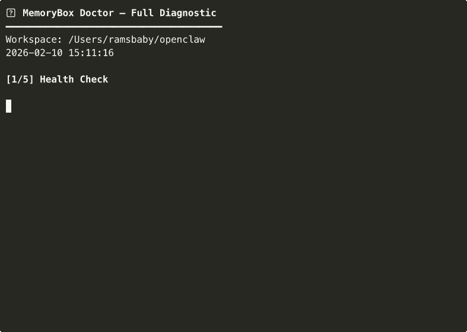

# 🧠 OpenClaw MemoryBox

> **Install once. Forget about memory management forever.**
>
> Zero dependencies. Works alongside Mem0, Supermemory, QMD — or standalone.

[](https://github.com/Ramsbaby/openclaw-memorybox/actions)
[](https://github.com/Ramsbaby/openclaw-memorybox/releases)
[](https://github.com/openclaw/openclaw)
[](https://opensource.org/licenses/MIT)
[](https://www.shellcheck.net/)
[](https://github.com/Ramsbaby/openclaw-memorybox/stargazers)


<p align="center">
  <a href="#-quick-start">⚡ Quick Start</a> •
  <a href="#-cli-commands">💻 CLI</a> •
  <a href="#-real-results">📊 Results</a> •
  <a href="#-how-it-works">🔧 How It Works</a> •
  <a href="#-faq">❓ FAQ</a>
</p>

---

## ⚡ Quick Start

**3 commands. 30 seconds. Done.**

```bash
git clone https://github.com/Ramsbaby/openclaw-memorybox.git
cd openclaw-memorybox && chmod +x bin/memorybox
sudo ln -sf "$(pwd)/bin/memorybox" /usr/local/bin/memorybox
```

**Now diagnose your workspace:**
```bash
memorybox doctor ~/openclaw
```

**That's it.** MemoryBox tells you exactly what's wrong and how to fix it.

**Next:** [See real results](#-real-results) • [All commands](#-cli-commands) • [Teach your agent](#-teach-your-agent-the-3-tier-pattern)

---

## 🎬 Demo



*Full diagnostic in one command: health check → size analysis → duplicates → stale content → suggestions*

---

## 🌟 The Problem

Your OpenClaw agent's `MEMORY.md` grows every day. At some point it hits 20KB+, gets loaded into **every session**, eats tokens, and eventually causes context overflow.

**The crash chain:**
```
Memory bloat → Context overflow → Compaction failure → Gateway crash
```

MemoryBox prevents this in 5 minutes:

```bash
memorybox doctor ~/openclaw   # diagnose
memorybox split ~/openclaw    # fix interactively
```

Your MEMORY.md stays lean. Your agent stays fast. **Move on to things that matter.**

---

## 🔧 How It Works

MemoryBox applies a simple 3-tier pattern (inspired by [Letta/MemGPT](https://github.com/letta-ai/letta)):

```
workspace/
├── MEMORY.md              ← Tier 1: Core facts only (≤10KB, loaded everywhere)
└── memory/
    ├── YYYY-MM-DD.md      ← Tier 1.5: Daily logs (today+yesterday, auto-loaded)
    ├── domains/           ← Tier 2: Detailed reference (searched on-demand)
    │   ├── persona.md
    │   ├── decisions.md
    │   └── ...
    ├── projects/          ← Tier 2: Per-project context
    └── archive/           ← Tier 3: Old daily logs (14+ days)
```

| Tier | Loaded when | Token cost |
|------|------------|------------|
| **Tier 1** | Every session, automatically | ~3.5KB (lean!) |
| **Tier 2** | On-demand via `memory_search` | Only when needed |
| **Tier 3** | Manual reference only | ~0 |

**Key insight:** OpenClaw's `memory_search` indexes `memory/**/*.md` recursively. Tier 2 files are automatically searchable — zero config changes.

---

## 📊 Real Results

Tested on a production instance (7 Discord channels, 48 crons, running 24/7):

| Metric | Before | After |
|--------|--------|-------|
| MEMORY.md | 20,542 bytes | 3,460 bytes (**-83%**) |
| Context pressure | 98% (constant compaction) | 7% (comfortable) |
| Compaction frequency | Multiple per session | Rare |
| `memory_search` | ✅ Works | ✅ Still works |
| Setup time | — | **5 minutes** |

> **Honest note:** The 83% reduction applies to MEMORY.md load — roughly 5-15% of total per-session tokens depending on conversation length. But in a 24/7 agent with 48 crons, those savings compound. More importantly, it **prevents the context overflow that crashes your agent** — and that's worth far more than the token savings alone.

---

## 💻 CLI Commands

```bash
memorybox doctor [path]    # Full diagnostic — start here
memorybox analyze [path]   # Section-by-section size breakdown with bar charts
memorybox split [path]     # Interactive: move large sections to domain files
memorybox health [path]    # Quick health score (0-100)
memorybox archive [path]   # Move old daily logs (14+ days) to archive/
memorybox dedupe [path]    # Find duplicate content across files
memorybox stale [path]     # Detect outdated content
memorybox suggest [path]   # Improvement recommendations
memorybox report [path]    # Before/after token savings
memorybox init [path]      # Set up 3-tier directory structure
```

**Most users only need two commands:**
1. `memorybox doctor` — see what's wrong
2. `memorybox split` — fix it interactively

### Options

```bash
memorybox -w ~/my-workspace doctor   # Custom workspace path
memorybox -d 7 archive               # Archive logs older than 7 days
memorybox -m 8000 health             # Custom max target (default: 10KB)
```

---

## 📦 Installation

### Option A: Quick Install (recommended)

```bash
git clone https://github.com/Ramsbaby/openclaw-memorybox.git
cd openclaw-memorybox && chmod +x bin/memorybox
sudo ln -sf "$(pwd)/bin/memorybox" /usr/local/bin/memorybox
```

### Option B: Manual

```bash
# Download just the CLI script
curl -sSL https://raw.githubusercontent.com/Ramsbaby/openclaw-memorybox/main/bin/memorybox -o /usr/local/bin/memorybox
chmod +x /usr/local/bin/memorybox
```

### Verify

```bash
memorybox --version   # memorybox v2.1.0
memorybox doctor ~/openclaw
```

---

## 🏥 Example: Doctor Output

```
🩺 MemoryBox Doctor — Full Diagnostic
━━━━━━━━━━━━━━━━━━━━━━━━━━━━━━━━━━━━━━
Workspace: /Users/you/openclaw
2026-02-11 17:00:00

[1/5] Health Check

    ✗ MEMORY.md over limit: 20,542 bytes (205%) 🚨
    ✓ domains/: 3 files
    △ 8 daily logs need archiving (>14 days)
    ✓ memory/ root is clean
    ✓ archive/ exists

    Health Score: 40/100 🚨 Critical

[2/5] Size Analysis

  MEMORY.md: 20,542 bytes (205%)
  domains/: 3,200 bytes
  Total managed: 23,742 bytes

[3/5] Duplicate Check

  ⚠️  2 potential duplicate lines

[4/5] Stale Content

  ⏰ 1 domain file(s) unchanged for 60+ days

[5/5] Suggestions

  📌 3 section(s) could be split to domains/
  🗄️  8 daily logs ready for archiving

━━━━━━━━━━━━━━━━━━━━━━━━━━━━━━━━━━━━━━
```

---

## 🔄 What This Is (and Isn't)

**MemoryBox is a maintenance tool**, like `df` for your agent's memory.

It doesn't replace your memory system — it keeps it healthy.

| Tool | What it does | Category |
|------|-------------|----------|
| **Mem0** | Decides *what* to remember | 🧠 Memory engine |
| **Supermemory** | Cloud-based persistent recall | 🧠 Memory engine |
| **QMD** | Local search backend | 🔍 Search engine |
| **MemoryBox** | Keeps files organized & lean | 🧹 Maintenance tool |

**You can use MemoryBox with all of the above, or with none of them.** It only touches file structure — never configs, never plugins, never internals.

---

## 📖 Origin Story

I run an OpenClaw agent 24/7 — 7 Discord channels, 48 cron jobs. As it learned, `MEMORY.md` ballooned to 20KB+. Every session loaded all of it.

One day, context hit 100%. Compaction corrupted state. I tried to fix the config — and **crashed the gateway**.

That crash led to **[openclaw-self-healing](https://github.com/Ramsbaby/openclaw-self-healing)** (auto-recovery in ~30s). But the *root cause* was memory bloat. So I built MemoryBox to prevent it from happening again.

```
Memory bloat → Context overflow → Gateway crash
  → Built self-healing (recover from crashes)
  → Built MemoryBox (prevent the bloat)
  → Problem solved at both ends.
```

---

## 🤖 Teach Your Agent the 3-Tier Pattern

Add to your `AGENTS.md`:

```markdown
## Memory Protocol
- **MEMORY.md** (≤10KB): Core facts only. Loaded everywhere — keep it lean.
- **memory/domains/*.md**: Detailed reference. Use `memory_search` to find.
- **memory/archive/**: Old logs. Rarely needed.

When MEMORY.md grows past 8KB, split large sections to domains/.
```

### Set It and Forget It (Optional Cron)

```json
{
  "name": "Memory Maintenance",
  "schedule": { "kind": "cron", "expr": "0 23 * * 0", "tz": "Asia/Seoul" },
  "sessionTarget": "isolated",
  "payload": {
    "kind": "agentTurn",
    "message": "Run: memorybox archive && memorybox health. Report if score < 80."
  }
}
```

---

## ✅ Compatibility

**Works with everything:**

| Plugin / Backend | Compatible | Notes |
|-----------------|-----------|-------|
| memory-core (default) | ✅ | No changes needed |
| Mem0 | ✅ | Different layer — no conflict |
| Supermemory | ✅ | Different layer — no conflict |
| QMD | ✅ | Indexes same files |
| `memory_search` | ✅ | Indexes `memory/**/*.md` recursively |
| `memory_get` | ✅ | Reads any `memory/` file |

**Does NOT touch:**
- `openclaw.json` — no config changes
- Plugin behavior — no overrides
- OpenClaw internals — files only

---

## 🤝 Companion Project

| Layer | Tool | What It Does |
|-------|------|-------------|
| **Prevention** | MemoryBox | Keeps memory lean → no context overflow |
| **Recovery** | **[Self-Healing](https://github.com/Ramsbaby/openclaw-self-healing)** | 4-tier auto-recovery → gateway back in ~30s |

Both zero-dependency, both MIT licensed, both battle-tested on the same production instance.

---

## ❓ FAQ

**Q: My MEMORY.md is only 5KB. Do I need this?**
A: Not yet. Bookmark it for when it grows. Or run `memorybox health` to confirm you're fine.

**Q: Will this break my existing setup?**
A: No. It only creates directories and moves content you approve. Backup is automatic.

**Q: Does `memory_search` find files in subdirectories?**
A: Yes. OpenClaw indexes `memory/**/*.md` recursively. [Official docs confirm this.](https://docs.openclaw.ai/concepts/memory)

**Q: I'm using Mem0/Supermemory. Should I also use this?**
A: Yes — they solve different problems. Mem0 decides *what* to remember. MemoryBox keeps your *file structure* clean so sessions load fast.

**Q: Will OpenClaw updates break this?**
A: Unlikely. This uses standard markdown files in the standard memory directory. OpenClaw's philosophy is "files are source of truth" — that won't change.

---

## 🤝 Contributing

PRs welcome! Areas for improvement:
- [ ] Migration script for different workspace layouts
- [ ] Automated MEMORY.md size monitoring via cron
- [ ] Domain file templates for common use cases
- [ ] Integration tests with memory_search
- [ ] `memorybox watch` — daemon mode for continuous monitoring

---

## 📜 License

MIT — Do whatever you want.

---

<p align="center">
  <strong>Made with 🦞 by <a href="https://github.com/ramsbaby">@ramsbaby</a></strong>
</p>

<p align="center">
  <em>Battle-tested on a production OpenClaw instance running 24/7 with 48 crons and 7 channels.</em>
</p>
